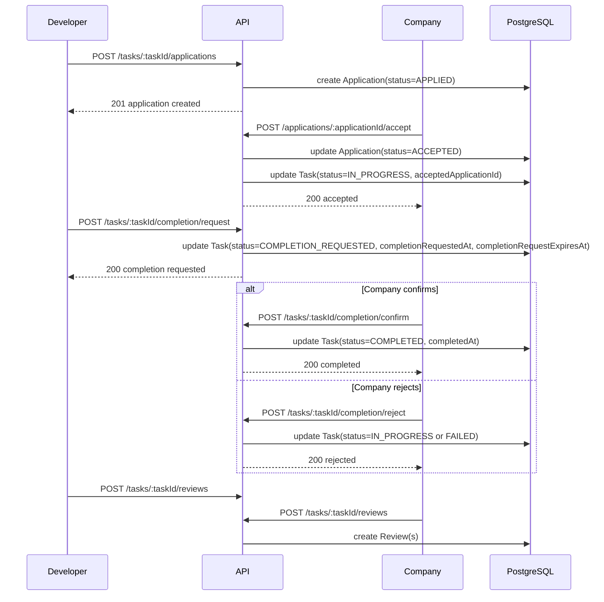
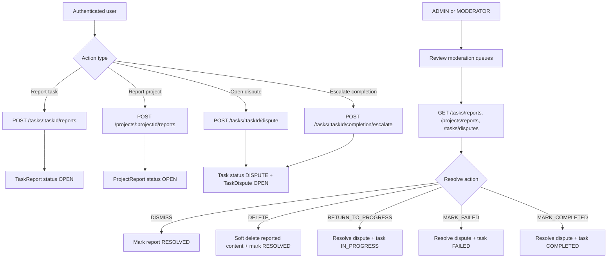
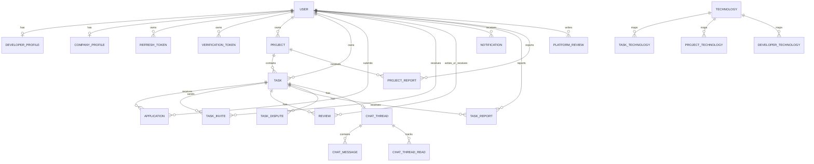

# Architecture

[Back to README](../README.md)

## Overview

The backend follows a layered Express architecture with thin controllers, Joi validation at the edge, domain-oriented services, and Prisma for persistence.

## Runtime flow

```text
HTTP request
  -> route
  -> auth / persona / validation middleware
  -> controller
  -> service
  -> db query helpers or Prisma client
  -> PostgreSQL
```

## Main layers

### Routes

Route modules in `src/routes/` define:

- URL structure
- middleware order
- auth and persona requirements
- schema validation
- controller binding

Examples of domain route modules:

- `auth.routes.js`
- `projects.routes.js`
- `tasks.routes.js`
- `me.routes.js`
- `platform-reviews.routes.js`

### Middleware

The middleware layer contains the shared request gates:

- `auth.middleware.js` validates JWT access tokens and loads admin/moderator status when needed
- `persona.middleware.js` enforces `X-Persona`
- `validate.middleware.js` applies Joi schemas to params, query, and body
- `error.middleware.js` maps domain errors to HTTP responses

### Controllers

Controllers remain HTTP-focused. They extract request input, call a service, and serialize the response.

Business rules are intentionally kept out of controllers.

### Services

The main application logic lives in `src/services/`.

Larger domains are split into focused modules:

```text
src/services/
  auth/
  invites/
  me/
  notifications/
  notification-email/
  profiles/
  projects/
  tasks/
  technologies/
  user/
```

Examples:

- `tasks/task-drafts.js` manages draft creation, update, publish, close, delete
- `tasks/candidates.js` ranks developers for company-side hiring workflows
- `tasks/workflows/*.js` handles apply, accept, reject, completion, dispute, and review transitions
- `projects/catalog.js` manages public and owner-aware project reads
- `projects/reporting.js` and `tasks/reporting.js` back moderation queues
- `me/threads-*.js` supports task-linked chat and read tracking

### Data access

Prisma is the only ORM used in the project.

The repository also centralizes repeated access patterns in `src/db/queries/`:

- `tasks.queries.js`
- `projects.queries.js`
- `profiles.queries.js`

This keeps service code focused on workflow and authorization logic instead of repeated query boilerplate.

## Domain model

The Prisma schema groups into the following functional areas.

### Identity and access

- `User`
- `RefreshToken`
- `VerificationToken`
- `User.roles` enum array with `USER`, `MODERATOR`, `ADMIN`

### Personas and public profiles

- `DeveloperProfile`
- `CompanyProfile`
- profile image metadata fields
- aggregate rating and review counters

### Work marketplace

- `Project`
- `Task`
- `Application`
- `TaskInvite`
- `TaskFavorite`

### Collaboration and feedback

- `ChatThread`
- `ChatMessage`
- `ChatThreadRead`
- `Notification`
- `Review`
- `PlatformReview`

### Moderation

- `ProjectReport`
- `TaskReport`
- `TaskDispute`

### Technology graph

- `Technology`
- `DeveloperTechnology`
- `TaskTechnology`
- `ProjectTechnology`
- `TechnologySuggestion`

## Key workflow design choices

### 1. Persona-based route access

The API allows one authenticated user to operate as developer or company depending on available profile and selected header.

This keeps authentication separate from business context.

### 2. Role-based moderation

Moderation is not handled through persona headers.

Instead, platform roles stored on `User.roles` drive:

- project report review
- task report review
- task dispute resolution
- platform review approval
- moderator role management

### 3. State-driven task lifecycle

Task behavior is modeled through Prisma enums and service checks.

Relevant states include:

- `DRAFT`
- `PUBLISHED`
- `IN_PROGRESS`
- `DISPUTE`
- `COMPLETION_REQUESTED`
- `COMPLETED`
- `FAILED`
- `CLOSED`
- `DELETED`

This makes workflow transitions explicit in both schema and service code.

### 4. Soft deletes for marketplace content

Projects and tasks use `deletedAt` timestamps instead of immediate hard deletes.

Benefits:

- preserves references for reviews, reports, and historical records
- allows owner-only access to deleted records where supported
- reduces accidental data loss during moderation or editing

### 5. Modular workflow services

Instead of a single large service file, the project splits logic by use case.

Examples:

- task catalog vs task draft management
- candidate ranking vs application handling
- completion flow vs dispute flow vs review flow

This matches the ESLint max-line limit applied to service files and makes tests more targeted.

### 6. Scheduled cleanup

`src/jobs/verification-token-cleanup.js` runs verification token cleanup:

- once on startup
- daily via cron at 03:00

The cleanup removes expired, used, and stale verification tokens.

### 7. Automatic project archiving

Task workflow code can archive a project automatically once the number of completed plus failed tasks reaches `Project.maxTalents`.

That logic lives in `tasks/workflows/project-archive.js`.

## Read visibility rules

The repository encodes several access patterns directly in services:

- public task catalog only returns `PUBLISHED` and `PUBLIC` tasks
- public project catalog only returns active public projects
- task detail for non-public tasks requires authenticated owner company context
- archived project detail is visible to the owner and to developers who previously worked on tasks in that project
- deleted project/task access is restricted to owner flows where explicitly supported

## API documentation architecture

Swagger is built from modular files under `src/docs/swagger/`.

```text
src/docs/swagger/
  constants.js
  paths/
  schemas/
```

The Express app mounts Swagger UI at `/api/v1/docs`.

## Testing architecture

The test suite uses two complementary layers.

### Unit tests

Unit tests cover service, controller, middleware, schema, and utility behavior in isolation.

### Integration tests

Integration tests exercise the full Express app with PostgreSQL through Testcontainers.

Current integration coverage includes:

- auth
- tasks and task workflows
- project review aggregation
- platform reviews
- me routes and chat
- moderator management
- technologies

## Repository structure reference

```text
src/
  app.js
  server.js
  config/
  controllers/
  db/
  docs/
  jobs/
  middleware/
  routes/
  schemas/
  services/
  templates/
  utils/
prisma/
  schema.prisma
  migrations/
  seed.js
tests/
  unit/
  integration/
```

## Workflow diagrams

### Apply -> accept -> completion -> review



### Moderation flow for reports and disputes



### Data model overview (high-level)


