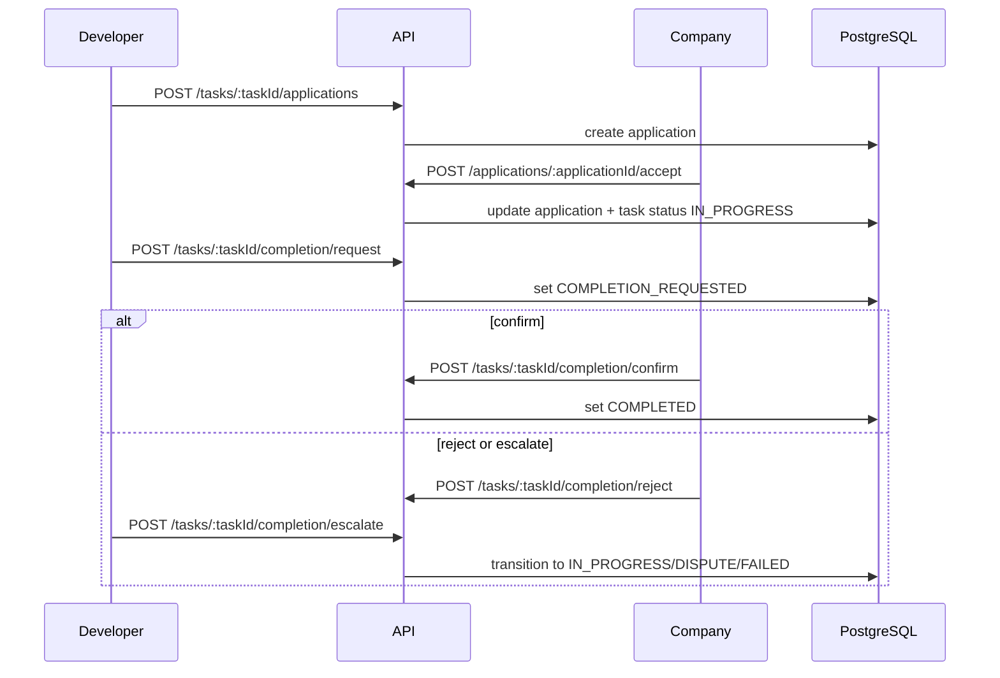

# Architecture

[Back to README](../README.md)

## Overview

The backend uses a layered Express architecture: route wiring at the edge, HTTP-focused controllers, domain services for business logic, and Prisma for persistence.

## Request Lifecycle

```text
HTTP request
  -> Route module
  -> Middleware (auth / persona / validation)
  -> Controller
  -> Service
  -> Prisma / query helpers
  -> PostgreSQL
  -> Normalized response or error middleware
```

## Layers and Responsibilities

### Routes (`src/routes`)

Route modules define endpoint structure and middleware order.

Current route groups:

- `auth.routes.js`
- `me.routes.js`
- `profiles.routes.js`
- `projects.routes.js`
- `tasks.routes.js`
- `applications.routes.js`
- `invites.routes.js`
- `users.routes.js`
- `admin.routes.js`
- `technologies.routes.js`
- `timezones.routes.js`
- `platform-reviews.routes.js`

### Middleware (`src/middleware`)

- `auth.middleware.js`: bearer token validation, admin/moderator checks
- `persona.middleware.js`: `X-Persona` enforcement and persona profile availability
- `validate.middleware.js`: Joi validation for params/query/body
- `error.middleware.js`: central error response formatting

### Controllers (`src/controllers`)

Controllers translate request/response only:

- parse and normalize input
- call services
- return HTTP status and response payload

### Services (`src/services`)

Business rules are implemented in domain modules (including workflow transitions):

```text
src/services/
  email-outbox/
  auth/
  chat/
  email/
  invites/
  me/
  notification-email/
  notifications/
  platform-reviews.service.js
  profiles/
  projects/
  tasks/
  technologies/
  timezones.service.js
  token/
  user/
```

Task workflow logic is intentionally split into focused files under `src/services/tasks/workflows`.

### Data Access (`src/db`)

Prisma is the only ORM layer.

Repeated access patterns are extracted to query helpers under `src/db/queries` to keep service code focused on business decisions.

## Domain Model

The Prisma schema (`prisma/schema.prisma`) covers these areas:

- identity and access: users, refresh tokens, verification tokens, roles
- personas and profiles: developer/company profiles
- marketplace core: projects, tasks, applications, invites, favorites
- collaboration: chat threads/messages, notifications, reviews
- moderation: project reports, task reports, task disputes
- discovery graph: technologies and relation tables
- platform feedback: platform reviews

## Access Control Design

### Persona-based behavior

Business context is selected per request via `X-Persona` (`developer` or `company`) for persona-dependent routes.

### Role-based moderation

Moderation/admin access uses persisted `User.roles` values (`ADMIN`, `MODERATOR`) and does not rely on persona headers.

## Workflow Modeling

Task state transitions are explicit in Prisma enum values and service checks.

Main task statuses:

- `DRAFT`
- `PUBLISHED`
- `IN_PROGRESS`
- `DISPUTE`
- `COMPLETION_REQUESTED`
- `COMPLETED`
- `FAILED`
- `CLOSED`
- `DELETED`

This makes lifecycle transitions testable and predictable across controllers and services.

## Data Retention and Cleanup

- tasks/projects use soft delete semantics (`deletedAt`)
- verification tokens, unverified users, and email outbox records are processed:
  - once at startup
  - by scheduled cron jobs (`UNVERIFIED_USER_CLEANUP_CRON`, `EMAIL_OUTBOX_WORKER_CRON`, `EMAIL_OUTBOX_CLEANUP_CRON`)

## API Documentation Architecture

Swagger is modular under `src/docs/swagger`:

```text
src/docs/swagger/
  constants.js
  paths/
  schemas/
```

`src/docs/swagger.js` aggregates these fragments into one OpenAPI document, served at `/api/v1/docs`.

## Testing Architecture

- unit tests validate service/controller/middleware/schema behavior in isolation
- integration tests validate full HTTP flows with PostgreSQL via Testcontainers

Global coverage gates are enforced in Jest and CI:

- statements: 90%
- branches: 80%
- functions: 95%
- lines: 90%

## High-Level Sequence



## Repository Structure

```text
src/
  app.js
  server.js
  config/
  controllers/
  db/
  docs/
  jobs/
  middleware/
  routes/
  schemas/
  services/
  templates/
  utils/
prisma/
  schema.prisma
  migrations/
  seed.js
tests/
  unit/
  integration/
```
